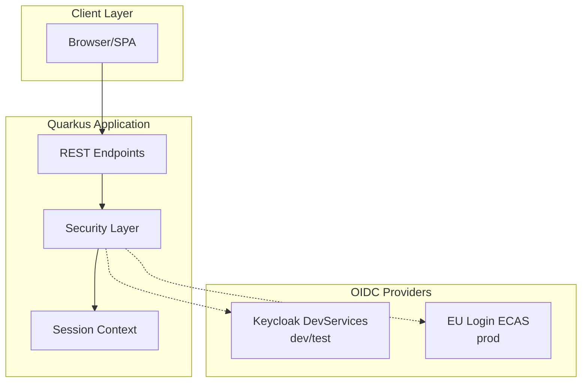
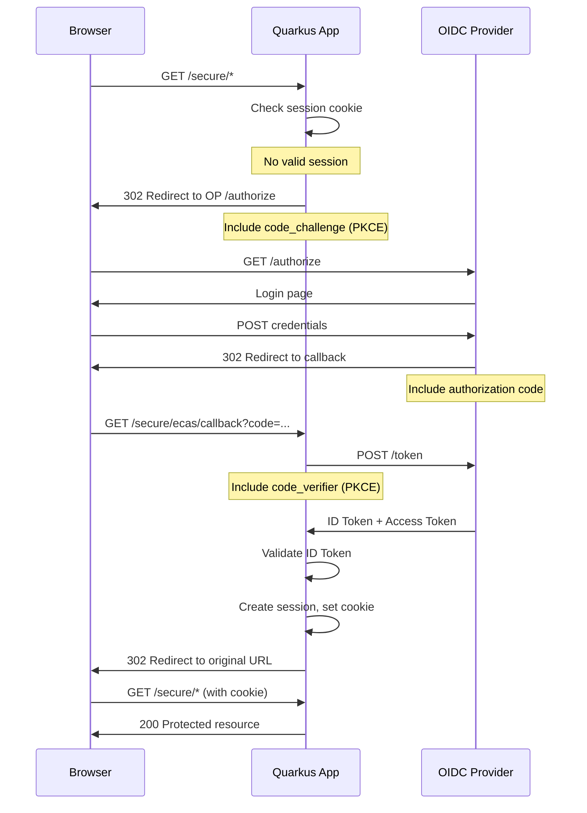
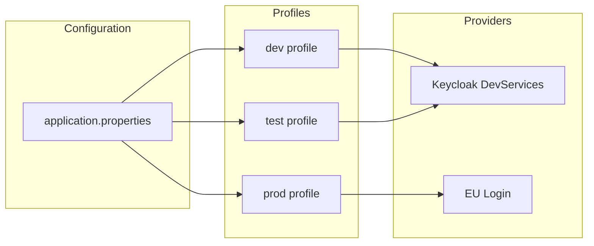
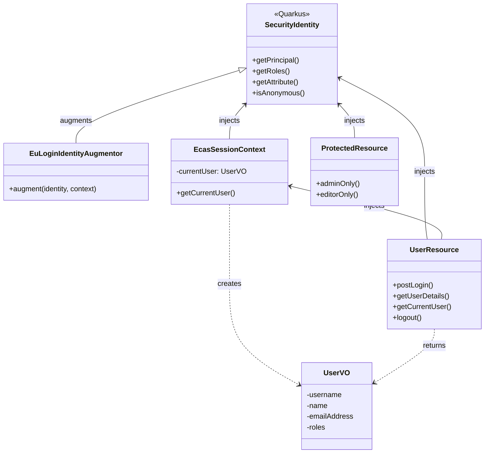

# Architecture

## System Overview

This application demonstrates EU Login OIDC integration with Quarkus using the Authorization Code flow with PKCE. It supports two authentication providers through profile-based configuration.



## Authentication Architecture

### OIDC Authorization Code Flow with PKCE



## Profile-Based Configuration

The application uses Quarkus profiles to switch between OIDC providers:



| Setting | Dev/Test | Production |
|---------|----------|------------|
| `quarkus.oidc.auth-server-url` | *Not set* (triggers DevServices) | `https://ecas.ec.europa.eu/cas/oauth2` |
| `quarkus.oidc.client-id` | Auto-configured | `eulogin-oicd-quarkus-demo` |
| Client Authentication | `client_secret_basic` | `client_secret_jwt` |

## Security Layers

```mermaid
graph TB
    subgraph "HTTP Request"
        REQ[Incoming Request]
    end
    
    subgraph "Security Pipeline"
        PERM[HTTP Auth Permissions]
        OIDC[OIDC Authentication]
        AUG[Identity Augmentor]
        RBAC[@RolesAllowed]
    end
    
    subgraph "Application"
        RES[REST Resource]
        CTX[EcasSessionContext]
    end
    
    REQ --> PERM
    PERM --> |authenticated path| OIDC
    PERM --> |public path| RES
    OIDC --> AUG
    AUG --> RBAC
    RBAC --> RES
    RES --> CTX
```

### HTTP Auth Permissions

Configured in `application.properties`:

| Permission | Paths | Policy |
|------------|-------|--------|
| public | `/hello`, `/rest/user`, `/rest/me`, `/q/*` | permit |
| secured | `/secure/*` | authenticated |
| admin | `/admin/*` | authenticated |
| protected | `/api/protected` | authenticated |

### Role-Based Access Control

Applied via `@RolesAllowed` annotations at the method level:

- `@RolesAllowed("administrator")` - Admin-only endpoints
- `@RolesAllowed("editor")` - Editor-only endpoints
- `@PermitAll` - Public endpoints (explicit)

## Component Relationships



## Design Decisions

### Why PKCE?
EU Login mandates PKCE (RFC 7636) for all OIDC clients. This prevents authorization code interception attacks. Quarkus handles the `code_challenge`/`code_verifier` exchange automatically when `pkce-required=true`.

### Why client_secret_jwt?
EU Login does not accept plain client secrets. The application must sign a JWT with the shared secret and send it to the token endpoint. This is configured via `quarkus.oidc.credentials.jwt.secret`.

### Why Request-Scoped Context?
The `SecurityIdentityAugmentor` runs before the request scope is active, so user data cannot be stored in a request-scoped bean during authentication. Instead, `EcasSessionContext` lazily builds the `UserVO` from `SecurityIdentity` during the first access within a request.

### Why DevServices?
Keycloak DevServices provides a zero-configuration local OIDC provider, eliminating the need for manual Keycloak setup. The realm configuration (`eulogin-realm.json`) ensures the local environment mirrors EU Login's behavior (PKCE, same claims structure).
