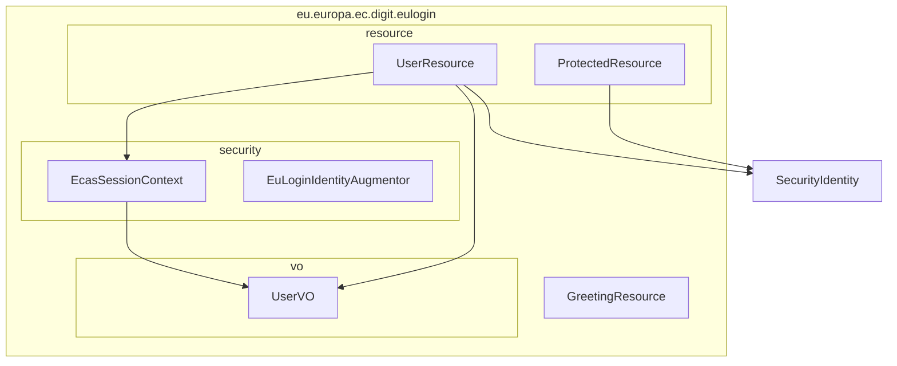

# Codebase Information

## Project Overview

**Project Name:** oidc-quarkus-demo  
**Group ID:** eu.europa.ec.digit.eulogin  
**Version:** 1.0.0-SNAPSHOT  
**Packaging:** Quarkus  
**Java Version:** 21

## Purpose

This is a demonstration application showing how to integrate **EU Login (ECAS) OpenID Connect authentication** with the **Quarkus framework**. It serves as a reference implementation for European Commission projects migrating from traditional ECAS authentication to OIDC-based authentication.

The project is modeled after patterns from the eCertis application, providing equivalent functionality for:
- Post-login redirects and session management
- User identity extraction from OIDC tokens
- Role-based access control with `@RolesAllowed`
- RP-initiated logout

## Technology Stack

| Category | Technology | Version |
|----------|------------|---------|
| Framework | Quarkus | 3.34.3 |
| Language | Java | 21 |
| Build Tool | Maven | 3.x (via Maven Wrapper) |
| REST | Quarkus REST (RESTEasy Reactive) | - |
| Security | Quarkus OIDC | - |
| JSON | Jackson | - |
| CDI | Quarkus Arc | - |
| Testing | JUnit 5, REST Assured | - |
| Dev Services | Keycloak (via Testcontainers) | - |

## Directory Structure

```
eulogin-oidc-quarkus-demo/
├── src/
│   ├── main/
│   │   ├── java/eu/europa/ec/digit/eulogin/
│   │   │   ├── GreetingResource.java       # Public endpoint
│   │   │   ├── resource/
│   │   │   │   ├── UserResource.java       # User/auth endpoints
│   │   │   │   └── ProtectedResource.java  # Role-protected endpoints
│   │   │   ├── security/
│   │   │   │   ├── EcasSessionContext.java     # Request-scoped user context
│   │   │   │   └── EuLoginIdentityAugmentor.java # Auth event logging
│   │   │   └── vo/
│   │   │       └── UserVO.java             # User value object
│   │   ├── resources/
│   │   │   ├── application.properties      # OIDC and HTTP configuration
│   │   │   ├── eulogin-realm.json         # Keycloak DevServices realm
│   │   │   └── META-INF/
│   │   └── docker/
│   │       └── Dockerfile.*                # Container build files
│   └── test/
│       └── java/eu/europa/ec/digit/eulogin/
│           ├── GreetingResourceTest.java   # Unit tests with @TestSecurity
│           └── GreetingResourceIT.java     # Integration tests
├── docs/
│   ├── oidc-configuration.md              # OIDC setup documentation
│   ├── presentation.md/.html              # Slide deck
│   └── speaker-script.md/.pdf             # Presentation notes
├── pom.xml                                 # Maven build configuration
└── mvnw / mvnw.cmd                        # Maven wrapper scripts
```

## Package Structure



## Key Configuration Files

### application.properties
- Profile-based OIDC configuration (`%prod` for EU Login, default for Keycloak DevServices)
- HTTP auth permissions defining public and secured paths
- CORS settings for local Angular development
- Session cookie security settings

### eulogin-realm.json
- Keycloak realm configuration for local development
- Pre-configured client with PKCE support
- Test users with administrator and editor roles
- Protocol mappers for email, given_name, family_name claims

## Authentication Profiles

| Profile | Auth Provider | Activation |
|---------|--------------|------------|
| `dev` | Keycloak DevServices | Default when running `./mvnw quarkus:dev` |
| `test` | Keycloak DevServices | Automatic in test mode |
| `prod` | EU Login (ECAS) | `java -Dquarkus.profile=prod ...` |

## Test Users (DevServices)

| Username | Password | Roles |
|----------|----------|-------|
| test1 | test | administrator |
| editor1 | test | editor |
