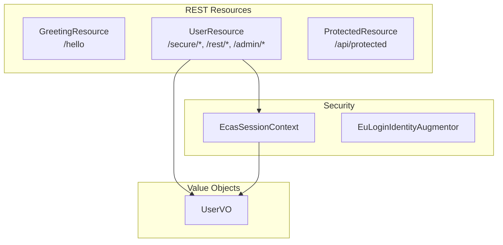

# Components

## Overview



---

## GreetingResource

**File:** `src/main/java/eu/europa/ec/digit/eulogin/GreetingResource.java`  
**Path:** `/hello`  
**Security:** `@PermitAll` (public)

### Purpose
Public endpoint requiring no authentication. Serves as the post-logout landing page and a health check endpoint.

### eCertis Equivalent
Mirrors public eCertis endpoints like `/criteria/**` and `/search/**` that don't require authentication.

### Methods

| Method | HTTP | Path | Returns |
|--------|------|------|---------|
| `hello()` | GET | `/hello` | `"Hello from Quarkus REST"` |

---

## UserResource

**File:** `src/main/java/eu/europa/ec/digit/eulogin/resource/UserResource.java`  
**Paths:** `/secure/ecas`, `/rest/user`, `/rest/me`, `/admin/logout`  
**Security:** Mixed (see endpoint table)

### Purpose
Central resource for user authentication lifecycle. Handles post-login redirects, user information retrieval, and logout. This is the Quarkus equivalent of eCertis `StartUpController`.

### eCertis Equivalent
`StartUpController` - handles ECAS authentication callbacks, user session setup, and logout

### Dependencies
- `SecurityIdentity` - Quarkus security context for accessing authenticated user
- `EcasSessionContext` - Request-scoped user context

### Methods

| Method | HTTP | Path | Security | Purpose |
|--------|------|------|----------|---------|
| `postLogin()` | GET | `/secure/ecas` | authenticated | Post-login redirect, forwards to `/rest/me` |
| `getUserDetails()` | GET | `/rest/user` | permit | Returns `UserVO` from `SecurityIdentity` (null if anonymous) |
| `getCurrentUser()` | GET | `/rest/me` | permit | Returns `UserVO` from `EcasSessionContext` |
| `logout()` | GET | `/admin/logout` | authenticated | Redirects to OIDC logout endpoint |

### Post-Login Flow
1. OIDC callback redirects to `/secure/ecas`
2. `postLogin()` redirects to `/rest/me`
3. Client receives user details

### Difference from eCertis
In eCertis, `userService.findUser(principal.getName())` loads user data from the database. Here, all user data comes from OIDC token claims.

---

## ProtectedResource

**File:** `src/main/java/eu/europa/ec/digit/eulogin/resource/ProtectedResource.java`  
**Path:** `/api/protected`  
**Security:** `@RolesAllowed` (role-based)

### Purpose
Demonstrates role-based access control using `@RolesAllowed` annotations. Shows how to protect endpoints by specific roles.

### eCertis Equivalent
Controllers using `@PreAuthorize("hasAuthority('administrator')")`:
- `UserController`
- `FeedbackController`
- `CoverageAreaController`
- `NotificationController`

### Dependencies
- `SecurityIdentity` - For accessing user principal and roles

### Methods

| Method | HTTP | Path | Role Required | Returns |
|--------|------|------|---------------|---------|
| `adminOnly()` | GET | `/api/protected` | `administrator` | User info with "administrator access" message |
| `editorOnly()` | GET | `/api/protected/editor` | `editor` | User info with "editor access" message |

### Response Format
```json
{
  "message": "You have administrator access",
  "user": "test1",
  "roles": ["administrator"]
}
```

---

## EcasSessionContext

**File:** `src/main/java/eu/europa/ec/digit/eulogin/security/EcasSessionContext.java`  
**Scope:** `@RequestScoped`

### Purpose
Provides request-scoped access to the current authenticated user. Lazily builds `UserVO` from `SecurityIdentity` on first access.

### eCertis Equivalent
`eu.europa.ec.grow.ecertis.http.EcasSessionContext` - Session-scoped bean populated during ECAS authentication

### Dependencies
- `SecurityIdentity` - Source of user identity and claims

### Methods

| Method | Returns | Description |
|--------|---------|-------------|
| `getCurrentUser()` | `UserVO` | Returns cached or newly built UserVO, null if anonymous |

### Claims Mapping

| UserVO Field | OIDC Claim | Source |
|--------------|------------|--------|
| `username` | `sub` | `identity.getPrincipal().getName()` |
| `emailAddress` | `email` | `identity.getAttribute("email")` |
| `name` | `given_name` + `family_name` | Concatenated if both present |
| `roles` | realm roles | `identity.getRoles()` |

### Why Lazy Loading?
The `SecurityIdentityAugmentor` runs before request scope activation, so user data cannot be stored during authentication. Lazy loading defers `UserVO` creation until the request scope is active.

---

## EuLoginIdentityAugmentor

**File:** `src/main/java/eu/europa/ec/digit/eulogin/security/EuLoginIdentityAugmentor.java`  
**Scope:** `@ApplicationScoped`

### Purpose
Logs successful OIDC authentications. Extension point for future identity augmentation (e.g., loading additional user data from a database).

### eCertis Equivalent
`EcasAuthenticationSuccessListener` - Spring Security listener for successful ECAS authentications

### Implements
`io.quarkus.security.identity.SecurityIdentityAugmentor`

### Methods

| Method | Parameters | Returns | Description |
|--------|------------|---------|-------------|
| `augment(identity, context)` | `SecurityIdentity`, `AuthenticationRequestContext` | `Uni<SecurityIdentity>` | Logs authentication, returns identity unchanged |

### Log Output
```
INFO  OIDC user authenticated: test1 (test1@ec.europa.eu)
```

### Extension Points
To augment the identity (e.g., add custom roles from database):
1. Inject a user service
2. Look up additional roles/claims
3. Return a `QuarkusSecurityIdentity.Builder` with added roles

---

## UserVO

**File:** `src/main/java/eu/europa/ec/digit/eulogin/vo/UserVO.java`

### Purpose
Value object representing authenticated user information. Simplified from eCertis to include only OIDC-relevant fields.

### eCertis Equivalent
`eu.europa.ec.grow.ecertis.vo.UserVO` - extends `AuditableVO`, includes `ProfileVO`, `roleIds`, and other application-specific fields

### Fields

| Field | Type | Description |
|-------|------|-------------|
| `username` | `String` | User's unique identifier (OIDC `sub` claim) |
| `name` | `String` | Display name (from `given_name` + `family_name`) |
| `emailAddress` | `String` | User's email address |
| `roles` | `Set<String>` | User's realm roles |

### Serialization
Standard getter/setter pattern. Serialized to JSON by Jackson for REST responses.
