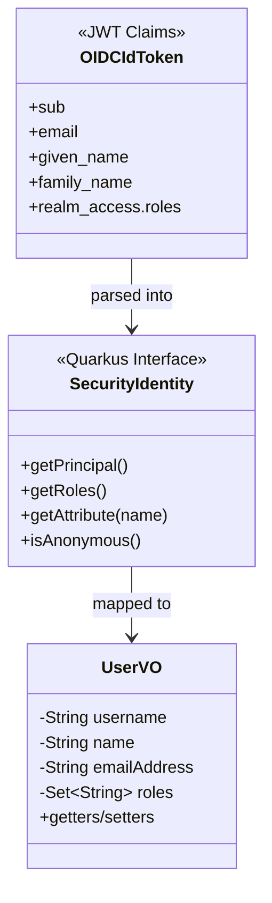
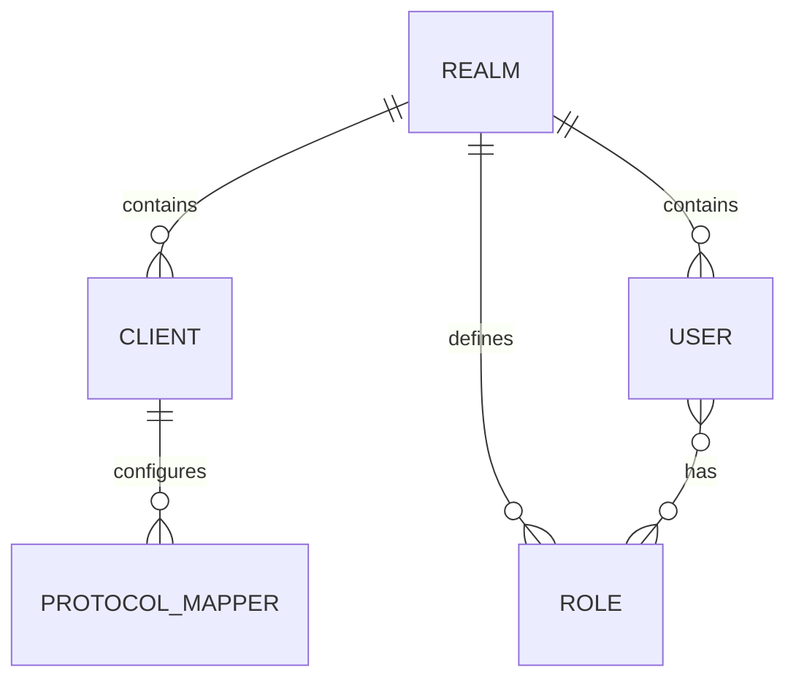

# Data Models

## Overview



---

## UserVO

**File:** `src/main/java/eu/europa/ec/digit/eulogin/vo/UserVO.java`

### Structure

```java
public class UserVO {
    private String username;      // OIDC sub claim
    private String name;          // given_name + family_name
    private String emailAddress;  // email claim
    private Set<String> roles;    // realm roles
}
```

### JSON Representation

```json
{
  "username": "test1",
  "name": "Test Administrator",
  "emailAddress": "test1@ec.europa.eu",
  "roles": ["administrator"]
}
```

### Field Mapping from OIDC Claims

| UserVO Field | OIDC Claim | Source in Quarkus |
|--------------|------------|-------------------|
| `username` | `sub` | `identity.getPrincipal().getName()` |
| `name` | `given_name` + ` ` + `family_name` | Concatenated from `identity.getAttribute()` |
| `emailAddress` | `email` | `identity.getAttribute("email")` |
| `roles` | `realm_access.roles` | `identity.getRoles()` |

### Notes
- `name` is only populated when both `given_name` and `family_name` are present in the token
- `roles` are extracted from Keycloak's `realm_access.roles` claim structure
- In EU Login production, roles come from group claims that must be explicitly requested

---

## OIDC Token Claims

### ID Token Structure (Keycloak DevServices)

```json
{
  "exp": 1699999999,
  "iat": 1699999000,
  "iss": "http://localhost:xxxxx/realms/eulogin",
  "sub": "test1",
  "email": "test1@ec.europa.eu",
  "email_verified": true,
  "given_name": "Test",
  "family_name": "Administrator",
  "realm_access": {
    "roles": ["administrator"]
  }
}
```

### ID Token Structure (EU Login Production)

```json
{
  "exp": 1699999999,
  "iat": 1699999000,
  "iss": "https://ecas.ec.europa.eu/cas/oauth2",
  "sub": "user123456",
  "email": "user@ec.europa.eu",
  "given_name": "John",
  "family_name": "Doe"
}
```

> **Note:** EU Login does not include roles by default. Groups must be explicitly requested in the client metadata and mapped via `quarkus.oidc.roles.role-claim-path`.

---

## Keycloak Realm Configuration

**File:** `src/main/resources/eulogin-realm.json`

### Schema Overview



### Realm Configuration

```json
{
  "realm": "eulogin",
  "enabled": true,
  "sslRequired": "none"
}
```

### Client Configuration

```json
{
  "clientId": "quarkus-app",
  "enabled": true,
  "publicClient": false,
  "secret": "secret",
  "redirectUris": ["*"],
  "webOrigins": ["*"],
  "directAccessGrantsEnabled": true,
  "attributes": {
    "pkce.code.challenge.method": "S256"
  },
  "defaultClientScopes": ["openid", "email", "profile"]
}
```

### Protocol Mappers

Configure which claims appear in tokens:

| Mapper | Claim | Source | Tokens |
|--------|-------|--------|--------|
| email | `email` | `user.email` | ID, Access, UserInfo |
| given_name | `given_name` | `user.firstName` | ID, Access |
| family_name | `family_name` | `user.lastName` | ID, Access |
| realm roles | `realm_access.roles` | Realm roles | ID, Access |

### Roles

```json
{
  "roles": {
    "realm": [
      { "name": "administrator" },
      { "name": "editor" }
    ]
  }
}
```

### Test Users

| Username | Email | Name | Roles | Password |
|----------|-------|------|-------|----------|
| test1 | test1@ec.europa.eu | Test Administrator | administrator | test |
| editor1 | editor1@ec.europa.eu | Test Editor | editor | test |

---

## SecurityIdentity (Quarkus)

The `SecurityIdentity` interface is Quarkus's representation of the authenticated user:

```java
public interface SecurityIdentity {
    Principal getPrincipal();           // Username (sub claim)
    Set<String> getRoles();             // User's roles
    <T> T getAttribute(String name);    // Access token claims
    boolean isAnonymous();              // Check if authenticated
}
```

### Accessing Claims

```java
// Username (sub claim)
String username = identity.getPrincipal().getName();

// Email
String email = identity.getAttribute("email");

// Custom claim
String customClaim = identity.getAttribute("custom_claim");

// Roles
Set<String> roles = identity.getRoles();
```

---

## Session Cookie

Quarkus OIDC stores session state in encrypted cookies:

| Cookie | Purpose |
|--------|---------|
| `q_session` | Encrypted session containing token references |

### Configuration

```properties
quarkus.oidc.authentication.cookie-same-site=strict
%dev.quarkus.oidc.token-state-manager.encryption-secret=dev-only-secret-at-least-32-chars!
```

- `SameSite=Strict` prevents CSRF attacks
- Encryption secret is required for dev mode (auto-generated in prod)
