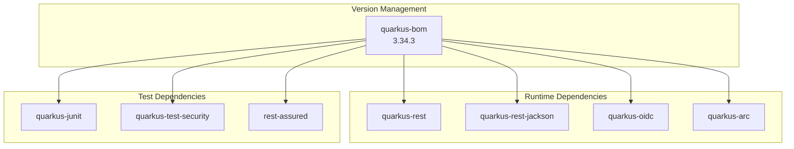

# Dependencies

## Overview

This project uses the Quarkus BOM (Bill of Materials) for version management. All Quarkus dependencies inherit their versions from the platform BOM.



---

## Runtime Dependencies

### quarkus-rest

**Purpose:** RESTEasy Reactive - JAX-RS implementation for Quarkus

**Used For:**
- `@Path`, `@GET`, `@POST` annotations
- `@Produces`, `@Consumes` media type declarations
- REST endpoint implementation

**Example:**
```java
@Path("/hello")
@GET
@Produces(MediaType.TEXT_PLAIN)
public String hello() {
    return "Hello from Quarkus REST";
}
```

---

### quarkus-rest-jackson

**Purpose:** Jackson JSON serialization for Quarkus REST

**Used For:**
- Automatic JSON serialization of response objects
- `MediaType.APPLICATION_JSON` support

**Example:**
```java
@Produces(MediaType.APPLICATION_JSON)
public UserVO getUserDetails() {
    // UserVO automatically serialized to JSON
}
```

---

### quarkus-oidc

**Purpose:** OpenID Connect authentication support

**Used For:**
- OIDC Authorization Code flow with PKCE
- Session management via encrypted cookies
- `SecurityIdentity` population from ID tokens
- DevServices for Keycloak (auto-starts in dev/test)

**Key Features:**
- `application-type=web-app` for server-side sessions
- Automatic token validation and refresh
- RP-initiated logout support
- Integration with HTTP auth permissions

**Configuration:**
```properties
quarkus.oidc.application-type=web-app
quarkus.oidc.authentication.pkce-required=true
quarkus.oidc.logout.path=/logout
```

---

### quarkus-arc

**Purpose:** CDI (Contexts and Dependency Injection) implementation

**Used For:**
- `@Inject` dependency injection
- `@ApplicationScoped`, `@RequestScoped` bean scopes
- CDI events and interceptors

**Example:**
```java
@RequestScoped
public class EcasSessionContext {
    @Inject
    SecurityIdentity identity;
}
```

---

## Test Dependencies

### quarkus-junit

**Purpose:** JUnit 5 integration for Quarkus tests

**Used For:**
- `@QuarkusTest` annotation
- Integration test support with live application
- DevServices auto-configuration in tests

**Example:**
```java
@QuarkusTest
class GreetingResourceTest {
    @Test
    void testPublicEndpoint() {
        given()
            .when().get("/hello")
            .then()
            .statusCode(200);
    }
}
```

---

### quarkus-test-security

**Purpose:** Mock security for testing protected endpoints

**Used For:**
- `@TestSecurity` annotation to simulate authenticated users
- Testing role-based access without real OIDC flow

**Example:**
```java
@Test
@TestSecurity(user = "test1", roles = "administrator")
void testProtected_withAdminRole() {
    given()
        .when().get("/api/protected")
        .then()
        .statusCode(200);
}
```

---

### rest-assured

**Purpose:** REST API testing library

**Used For:**
- Fluent API for HTTP request/response testing
- JSON path assertions
- Integration with JUnit 5

**Example:**
```java
given()
    .when().get("/rest/user")
    .then()
    .statusCode(200)
    .body("username", is("test1"))
    .body("$", hasKey("roles"));
```

---

## BOM Configuration

```xml
<dependencyManagement>
    <dependencies>
        <dependency>
            <groupId>io.quarkus.platform</groupId>
            <artifactId>quarkus-bom</artifactId>
            <version>3.34.3</version>
            <type>pom</type>
            <scope>import</scope>
        </dependency>
    </dependencies>
</dependencyManagement>
```

**Benefits:**
- Consistent versions across all Quarkus dependencies
- Tested dependency combinations
- Simple version updates (change BOM version only)

---

## Build Plugins

### quarkus-maven-plugin

**Purpose:** Quarkus build and dev mode support

**Goals:**
- `quarkus:dev` - Development mode with live reload
- `quarkus:build` - Production build
- `quarkus:test` - Continuous testing

### maven-compiler-plugin

**Version:** 3.15.0  
**Configuration:**
- `maven.compiler.release=21` - Java 21 target
- `parameters=true` - Preserve parameter names for reflection

### maven-surefire-plugin

**Version:** 3.5.4  
**Purpose:** Unit test execution

### maven-failsafe-plugin

**Version:** 3.5.4  
**Purpose:** Integration test execution (`*IT.java`)

---

## Transitive Dependencies

Key transitive dependencies provided by the Quarkus extensions:

| Provided By | Includes |
|-------------|----------|
| quarkus-rest | Vert.x, Netty, RESTEasy Reactive |
| quarkus-oidc | SmallRye JWT, Jose4j, Keycloak DevServices |
| quarkus-arc | CDI API, ArC implementation |
| quarkus-rest-jackson | Jackson Databind, Jackson Annotations |

---

## Adding New Dependencies

When adding new dependencies:

1. **Check if it's in the BOM** - Use dependency without version if managed
2. **Prefer Quarkus extensions** - Better integration and native compilation support
3. **Use exact versions for non-BOM deps** - Avoid version ranges

```xml
<!-- BOM-managed (no version needed) -->
<dependency>
    <groupId>io.quarkus</groupId>
    <artifactId>quarkus-hibernate-orm-panache</artifactId>
</dependency>

<!-- Non-BOM (specify version) -->
<dependency>
    <groupId>org.example</groupId>
    <artifactId>custom-lib</artifactId>
    <version>1.2.3</version>
</dependency>
```
