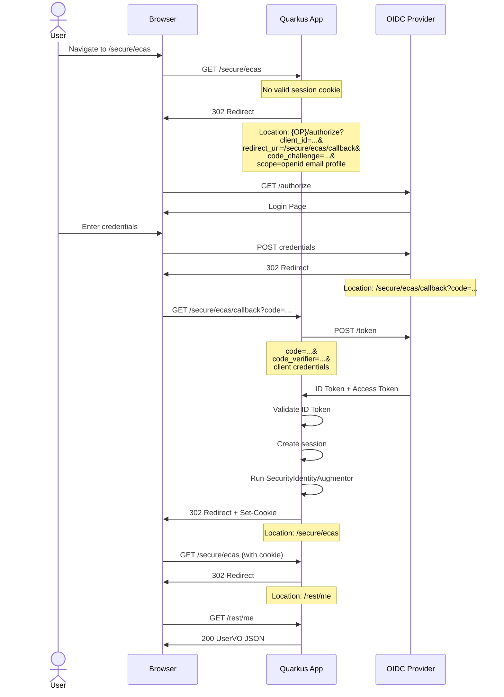
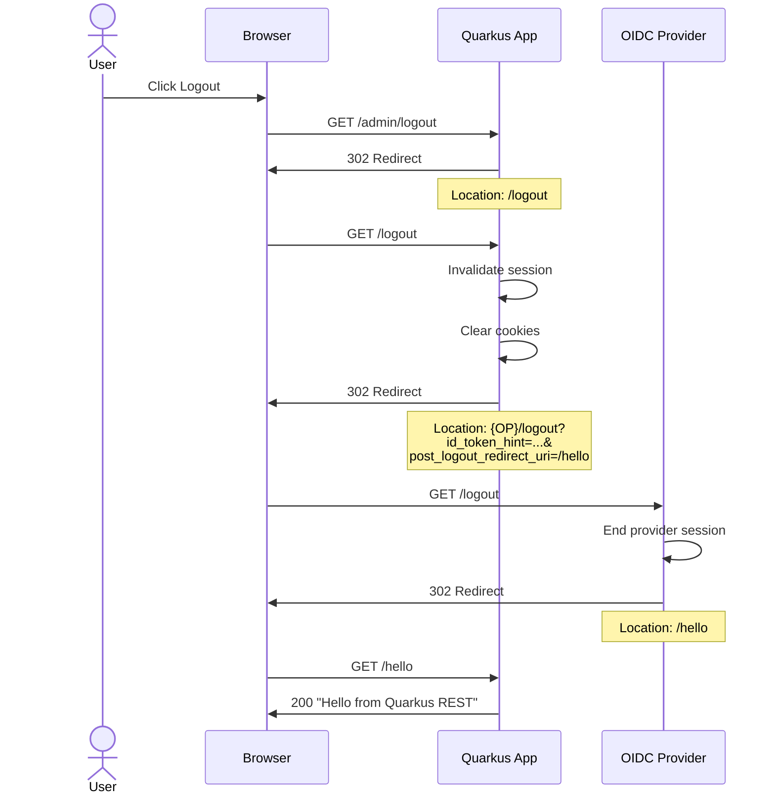
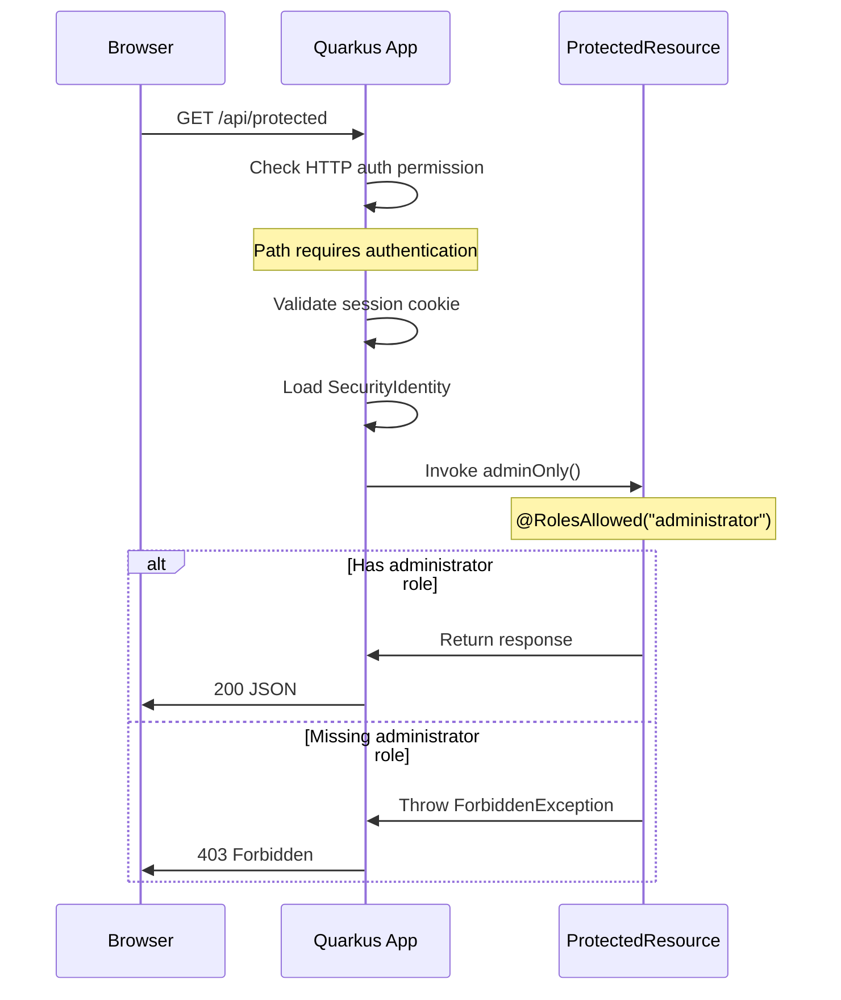
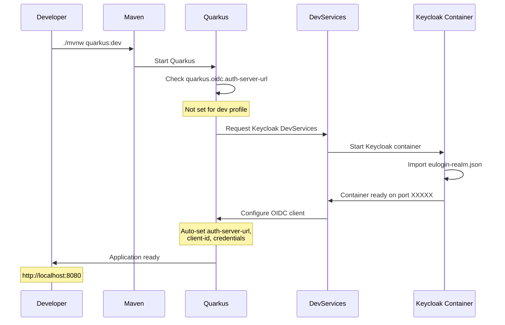
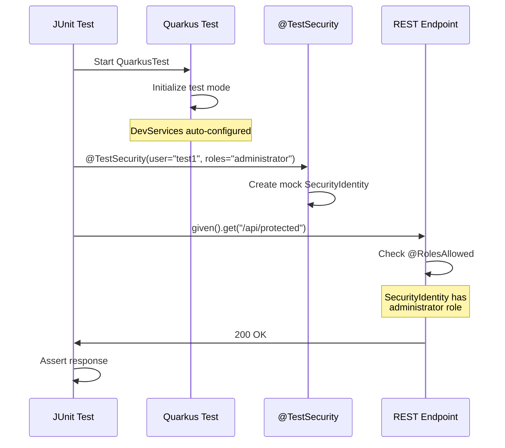
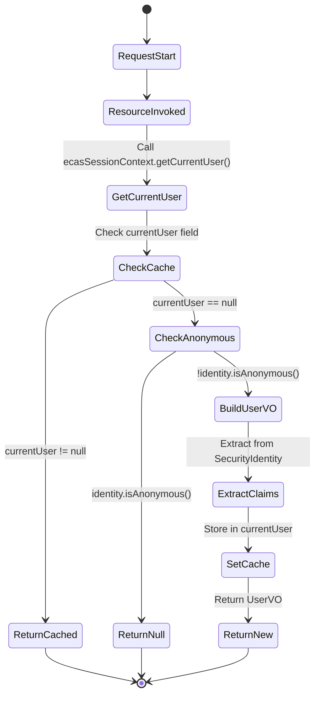
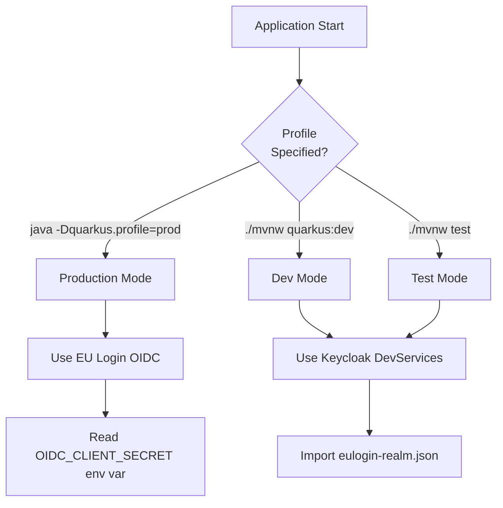
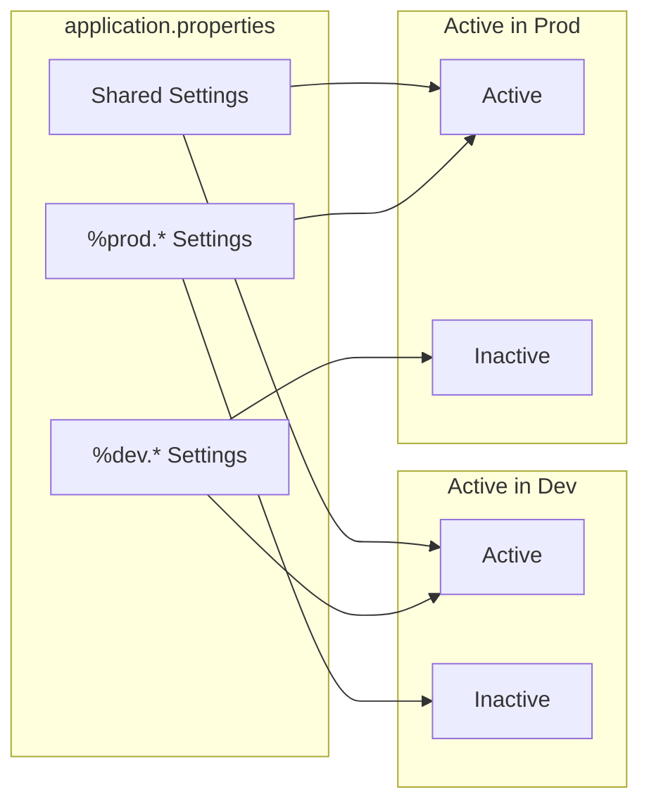

# Workflows

## Authentication Workflows

### Login Flow



### Logout Flow



---

## Authorization Workflows

### Role-Based Access Flow



### Permission Evaluation Order

```mermaid
graph TD
    REQ[Incoming Request] --> PERM{HTTP Auth<br/>Permission Check}
    PERM -->|permit| RES[Resource Method]
    PERM -->|authenticated| AUTH{Valid<br/>Session?}
    AUTH -->|no| OIDC[OIDC Redirect]
    AUTH -->|yes| ROLES{@RolesAllowed<br/>Check}
    ROLES -->|pass| RES
    ROLES -->|fail| FORBID[403 Forbidden]
    OIDC --> LOGIN[Login Flow]
    LOGIN --> AUTH
```

---

## Development Workflows

### DevServices Startup



### Test Execution



---

## Request Processing Workflow

### Authenticated Request

```mermaid
graph TB
    subgraph "Request Phase"
        REQ[HTTP Request] --> FILTER[Auth Filter]
        FILTER --> COOKIE{Session<br/>Cookie?}
        COOKIE -->|yes| VALIDATE[Validate Session]
        COOKIE -->|no| REDIRECT[OIDC Redirect]
        VALIDATE --> IDENTITY[Build SecurityIdentity]
    end
    
    subgraph "Augmentation Phase"
        IDENTITY --> AUG[EuLoginIdentityAugmentor]
        AUG --> LOG[Log Authentication]
    end
    
    subgraph "Processing Phase"
        LOG --> RBAC[@RolesAllowed Check]
        RBAC --> CTX[Request Scope Active]
        CTX --> RES[REST Resource]
        RES --> ESC[EcasSessionContext]
        ESC --> UVO[Build UserVO]
    end
    
    subgraph "Response Phase"
        UVO --> JSON[JSON Serialization]
        JSON --> RESP[HTTP Response]
    end
```

### UserVO Creation (Lazy Loading)



---

## Configuration Workflow

### Profile Selection



### Property Resolution


